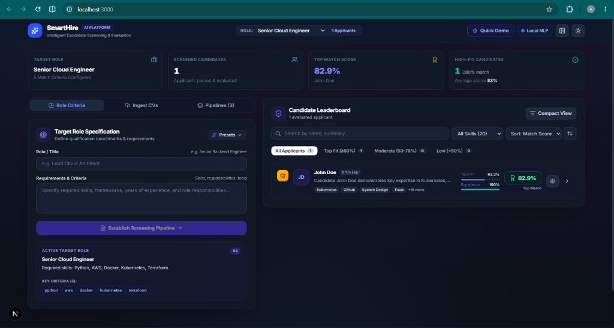

# 🚀 SmartHire

An intelligent AI-powered resume screening and candidate ranking platform that matches candidates with job descriptions through multi-dimensional scoring and deep profile analysis.


---

<p align="center">
  
</p>

---

## ✨ Features

- **🎯 Smart Job Alignment**: Parse job descriptions, set minimum qualification thresholds, and customize scoring weights.
- **📄 Multi-Resume Screening**: Bulk upload candidate resumes (PDF, DOCX, TXT) with fast extraction and parallel processing.
- **🏆 Ranked Leaderboard**: Automatically ranks candidates into tiers (Top Match, Strong Fit, Potential, Not Recommended).
- **📊 Multi-Dimensional Scoring**: Evaluates candidates across 4 core vectors:
  - Technical Skills Match
  - Relevant Experience
  - Education & Certifications
  - Soft Skills & Communication
- **🔍 Deep Profile Inspection**: Interactive radial gauge breakdown, candidate summary, strengths & gap analysis, and career timeline.
- **⚔️ Side-by-Side Comparison**: Compare multiple candidates simultaneously to make informed hiring decisions.

<p align="center">
  
</p>

## 📋 Business Requirements & Objectives (SmartHire)

This project aims to solve the problem of manual, slow, and inconsistent first-pass resume screening by providing a lightweight, locally hosted tool that ranks candidates against a job description.

For the complete business context, timeline, and risk analysis, please read the full **[Business Requirements Document (BRD)](BRD.md)**.

### Business Objectives
- **Reduce Recruiter Time**: Achieve at least a 50% reduction in time-to-shortlist for first-pass screening.
- **Improve Consistency**: Apply the same criteria to 100% of candidates for a role, targeting at least 80% ranking agreement with human reviewers on top candidates.
- **Protect Candidate Data**: Ensure zero candidate data is sent to external services in the default configuration.
- **Low Cost of Ownership**: Run on standard hardware without per-seat or per-resume license fees.
- **Defensible Decisions**: Provide a viewable score breakdown for every ranking to support defensible hiring decisions.
- **Faster Hiring**: Reduce the time from application close to interview invitations.

### Key Business Requirements
- **Role Definition**: Define a role by its job description and identify key requirements automatically.
- **Bulk Processing**: Process many resumes in common formats in one operation.
- **Consistent Evaluation**: Evaluate every candidate for a role against the same criteria.
- **Ranked Leaderboard**: Present candidates in ranked order with a visible, understandable score breakdown.
- **Side-by-Side Comparison**: Allow reviewers to compare shortlisted candidates side by side.
- **Data Privacy**: Keep candidate data within the organization's control by default.
- **Offline Usability**: Remain usable if the AI model is unavailable (graceful degradation to rule-based mode).
- **Human-in-the-Loop**: Do not automatically reject or advance candidates; a human must make final decisions.
- **Data Management**: Allow users to remove a role and all related candidate data on demand.
- **Exporting**: Enable exporting of rankings and comparisons for sharing with hiring managers.
- **Scoring Customization**: Allow tailoring of scoring (weights, must-have skills) to each role.
- **Error Reporting**: Report resumes that could not be processed.
- **Access Control**: Restrict access to authorized staff and retain a record of who viewed or changed candidate data.
- **ATS/Email Integration**: Support future integration with the organization's ATS and email.
- **Fairness Monitoring**: Monitor screening outcomes for adverse impact.

---

## 🛠️ Architecture & Tech Stack

- **Frontend**: [Next.js](https://nextjs.org/) (App Router, React 19, TypeScript), Tailwind CSS, Lucide Icons, Recharts.
- **Backend**: [FastAPI](https://fastapi.tiangolo.com/) (Python 3.10+), Uvicorn, SQLite database.

---

## ⚡ Quick Start

### Prerequisites
- **Node.js** (v18+)
- **Python** (v3.10+)
- **Git**

### Automated Start (Windows)
Run the automated launcher from the project directory:
```powershell
.\run.ps1
```
or double-click `run.bat`.

---

### Manual Start

#### 1. Backend (FastAPI)
```powershell
cd backend
python -m venv venv
.\venv\Scripts\Activate.ps1
pip install -r requirements.txt
python -m uvicorn app.main:app --host 0.0.0.0 --port 8000 --reload
```
API Documentation will be available at: [http://localhost:8000/docs](http://localhost:8000/docs)

#### 2. Frontend (Next.js)
```powershell
cd frontend
npm install
npm run dev
```
Open your browser at: [http://localhost:3000](http://localhost:3000)

---

## 📂 Project Structure

```
smarthire/
├── assets/
│   └── dashboard-preview.png
├── backend/
│   ├── app/
│   │   ├── main.py
│   │   ├── models/
│   │   └── services/
│   └── requirements.txt
├── frontend/
│   ├── app/
│   │   ├── components/
│   │   ├── globals.css
│   │   ├── layout.tsx
│   │   └── page.tsx
│   └── package.json
├── test_resumes/
├── run.bat
├── run.ps1
└── README.md
```

---

## 📄 License
MIT License.
